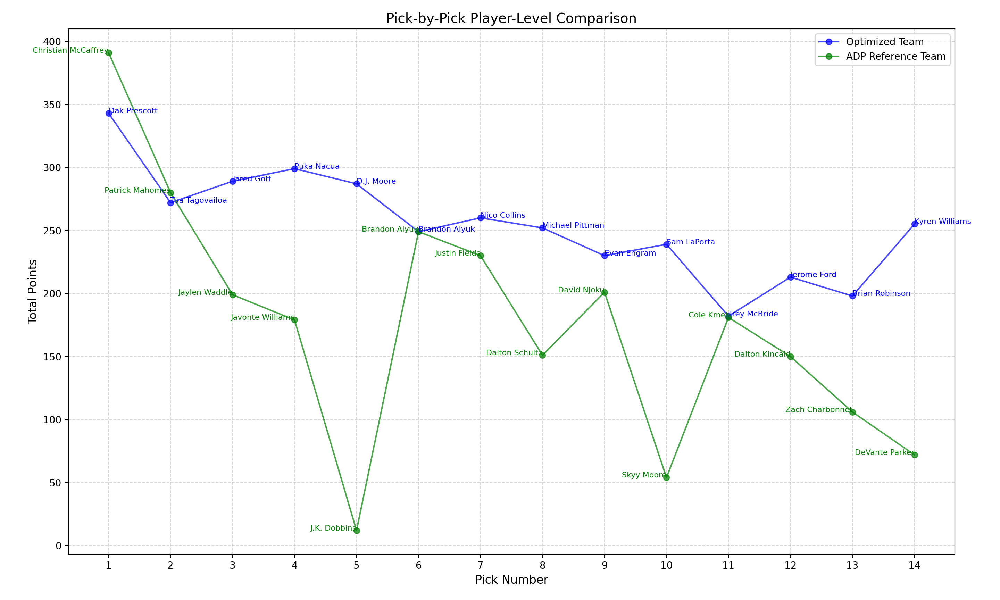

# Fantasy Football Agent: Finding Optimal Draft Picks using a Genetic Algorithm

## Overview

Fantasy football has a massive following, with the two largest platforms being ESPN (twelve million users) and Yahoo (ten million users). 
Most users rely on little more than a gut feeling, advice from podcasts or articles, and the ADP (average draft position) provided by their respective platforms.

What is fantasy football?    
Fantasy football is a virtual game where users select a unique set of players to compete with for the entire season. To win a week in fantasy football, 
your players must score more total points than your opponent's players. Players are selected through a draft process, where a group of users takes turns picking players. 
To ensure fairness, each user is assigned a set of “draft picks” that determines the order in which players are selected 
(e.g., the user with pick one selects a player before the user with pick two). Players are assigned an ADP (average draft position), 
which reflects where in the draft a player is usually taken, to guide users on when to select certain players.

The goal of this project is to predict the strongest possible fantasy football team that a user could draft for a given season. 
To achieve this, we collected data on each player and used a genetic algorithm to analyze it. 
Teams were ranked by the total points scored by their selected players over a season. For comparison, 
we calculated the average performance of a team composed of players selected based on their ADP at the same draft positions. 

## Features

## Document Overview

## Getting Started

### Prequisites

### Installation

## Model and Tokenizer
# Genetic Algorithm and Validation Code: Quick Start Guide

## **Guideline for Genetic Algorithm Code**
Tips: all the document are in the geneticAlgo file

### **Quick Start Steps**
1. **Get the Data**
   - Run `datainjectionFromAWS.py` to fetch the cooked data from the AWS database.

2. **Save the Data**
   - Find a local path to store the source data.
   - Copy the path into your computer for easy reference.

3. **Run the Driver**
   - Execute `runWithADP.py`. This is the main driver for the genetic algorithm.

4. **Check the Output**
   - After running the driver, you will get the following results:
     1. **Chart**: A visual comparison between the final team and the ADP team.
     2. **Excel File**: The final picked team with its detailed data organized by years.
     3. **Excel File**: Recommended agent with its optimized weights.
     4. **Excel File**: ADP reference team with its detailed data organized by years.

---

## **Guideline for Validation of Genetic Algorithm Code**

### **Quick Start Steps**
1. **Environment Setup**
   - Ensure the following files are in place:
     - `validateAgent.py`
     - `runWithADP.py`
     - `recommended_agent_weights.xlsx` (output from the genetic algorithm code, representing the best agent).

2. **Run the Driver**
   - Execute `validateAgent.py`. 
   - It will fetch the 2023 data from AWS and use the recommended agent to run the team-picking process.

3. **Check the Output**
   - After running the validation, you will get the following results:
     1. **Chart**: A visual comparison between the final team and the ADP team.
     2. **Chart**: A pick-by-pick comparison between the ADP team and the optimized team.
     3. **Excel File**: The 2023 source meta data for reference.
     4. **Excel File**: The final picked team for both the ADP team and the optimized team based on the best agent.

Result : 

## Acknowledgements

### [A genetic algorithm to solve the production lot-sizing problem with capacity adjustment](https://www.sciencedirect.com/science/article/pii/S0305054824002788)

### [Draft-Kings-Genetic-Solution](https://github.com/Rogerctoussaint/Draft-Kings-Genetic-Solution), reference in drafting

### [Top-Genetic-Algorithm](https://github.com/rafa2000/Top-Genetic-Algorithm/blob/master/readme.md), Many ideas on GA
